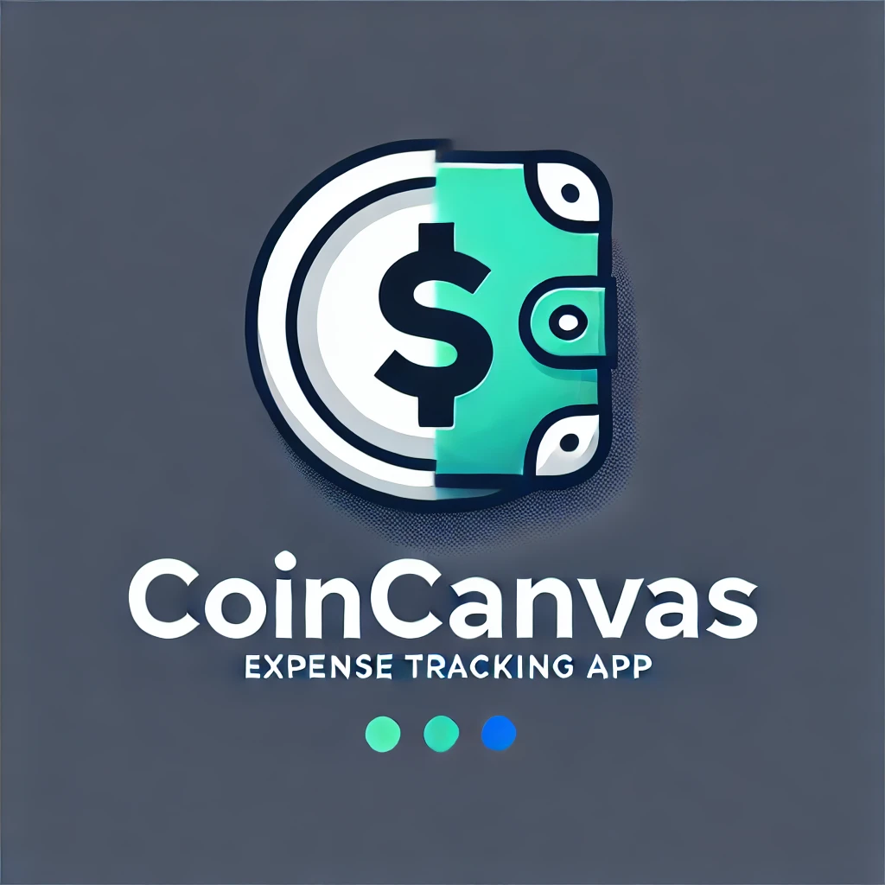
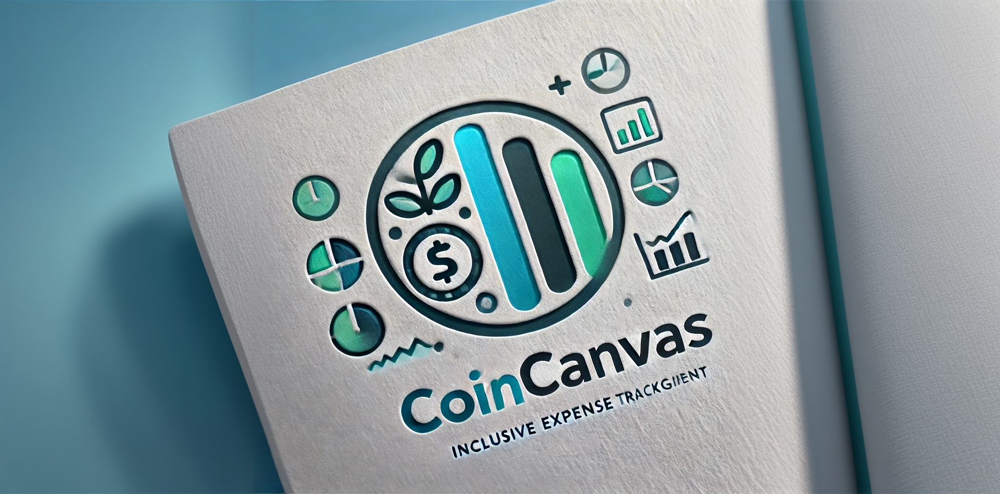

<p align="center">
  
</p>

[](https://doi.org/10.5281/zenodo.14027393)

<!-- [](https://github.com/DFY-NCSU/CoinCanvas) -->
[](https://github.com/DFY-NCSU/CoinCanvas/actions/workflows/test_backend.yml)
[](https://codecov.io/gh/DFY-NCSU/CoinCanvas/tree/main)
[](https://github.com/DFY-NCSU/CoinCanvas/actions/workflows/flake8.yml)
[](https://github.com/DFY-NCSU/CoinCanvas/actions/workflows/syntax.yml)
[](https://github.com/DFY-NCSU/CoinCanvas/actions/workflows/style.yml)
<!-- [](https://codecov.io/gh/DFY-NCSU/CoinCanvas/tree/main) -->

<a href="https://github.com/DFY-NCSU/CoinCanvas/blob/main/LICENSE.md"></a>
<a href="https://github.com/DFY-NCSU/CoinCanvas/forks"></a>
<a href="https://github.com/DFY-NCSU/CoinCanvas/stargazers"></a>
<a href="https://github.com/DFY-NCSU/CoinCanvas/issues"></a>
<a href="https://github.com/DFY-NCSU/CoinCanvas/issues?q=is%3Aissue+is%3Aclosed">
<a href="https://github.com/DFY-NCSU/CoinCanvas/pulls">
<a href="https://github.com/DFY-NCSU/CoinCanvas/pulls?q=is%3Apr+is%3Aclosed">
<a href="https://github.com/DFY-NCSU/CoinCanvas/discussions">


# 💡 Transform Your Financial Story with CoinCanvas

Ever stared at your bank statement wondering where your money went? You're not alone. CoinCanvas transforms the complex world of personal finance into a clear, visual story. Whether you're splitting expenses with roommates, planning a group vacation, or working toward personal financial goals, CoinCanvas makes it simple and intuitive.



## 🎨 Why CoinCanvas?

Think of your finances as a blank canvas. Each expense is a brushstroke, each saving goal a color, each shared expense a collaborative art piece. CoinCanvas is your smart easel, helping you create a masterpiece of financial clarity.

## 👥 Who Should Use CoinCanvas?

- **Young Professionals** balancing career growth with social life
- **Students** managing shared housing expenses
- **Families** coordinating household budgets
- **Freelancers** tracking variable income and expenses
- **Group Travelers** organizing trip expenses
- **Anyone** seeking financial clarity and control

## ✨ Key Features

- **🗓️ Flexible Time Recording**  
  Unlike other expense trackers that require immediate input, CoinCanvas lets you record expenses whenever it's convenient. Whether it's from last week's dinner or today's coffee, our date selection feature ensures your financial records stay accurate and complete.

- **💻 True Cross-Platform Experience**  
  CoinCanvas isn't just "cross-platform capable" - it's truly cross-platform optimized. Access and manage your expenses seamlessly across web, mobile, and desktop platforms with a consistent, user-friendly interface.

- **🤖 AI-Powered Financial Intelligence**  
  Exclusive to CoinCanvas: Advanced AI analysis that transforms your spending data into actionable insights:
  - Personalized spending pattern analysis
  - Smart budget recommendations
  - Predictive expense forecasting
  - Anomaly detection for unusual spending
  - AI-driven saving opportunities

## 🚀 Quick Start

### Backend Setup
```bash
# Install dependencies
pip install -r backend/requirements.txt

# Start the server
uvicorn backend.app.main:app --reload

# Access API documentation
open http://127.0.0.1:8000/docs
```

### Frontend Setup
```bash
# enter the working directory
cd frontend

# Ensure Flutter is installed
flutter doctor

# Get dependencies
flutter pub get

# Run the application
flutter run -d chrome
```

### Demo Database

Download our demo database from [Google Drive](https://drive.google.com/file/d/1tA9uxEWfziiNkTtT1AWyrvG4DrXnj3Te/view?usp=sharing) to try out all features immediately.

To login, you can use `email=email@test.com` and `password=pass123`.

## 🔮 Coming Soon: AI-Powered Financial Intelligence

Our upcoming AI features will revolutionize your financial planning:

- **📝 Smart Budgeting Advice**  
  Personalized recommendations based on your patterns

- **💡 Savings Opportunities**  
  AI-detected areas for cost reduction

- **🔮 Expense Prediction**  
  Anticipate and prepare for future expenses

- **⚠️ Anomaly Detection**  
  Smart alerts for unusual spending

- **🎯 Goal Setting**  
  AI-assisted realistic financial targets

## 🌟 Success Stories

> "CoinCanvas turned our house's expense management from a monthly headache into a seamless experience. Now we can focus on being roommates instead of accountants!" - Maowen, 23

> "Setting and tracking financial goals has never been easier. I'm finally making progress on my savings goals!" - Hannah, 27

## 📚 Documentation

- [Installation Guide](docs/INSTALL.md)
- [User Tutorial](docs/MiniTutorial.md)
- [API Documentation](http://127.0.0.1:8000/docs) (needs the backend to be running)
- [Contributing Guidelines](CONTRIBUTING.md)

## 🤝 Community & Support

- [Report Issues](https://github.com/DFY-NCSU/CoinCanvas/issues/new?assignees=&labels=&projects=&template=bug_report.md&title=)
- [Feature Requests](https://github.com/DFY-NCSU/CoinCanvas/issues/new?assignees=&labels=&projects=&template=feature_request.md&title=)
- [Discussions](https://github.com/DFY-NCSU/CoinCanvas/discussions)

## 📜 License

This project is licensed under the MIT License - see the [LICENSE](LICENSE) file for details.

---

<p align="center">
  <i>Your financial masterpiece begins with a single stroke.</i><br>
  Start painting your financial future today with CoinCanvas.
</p>